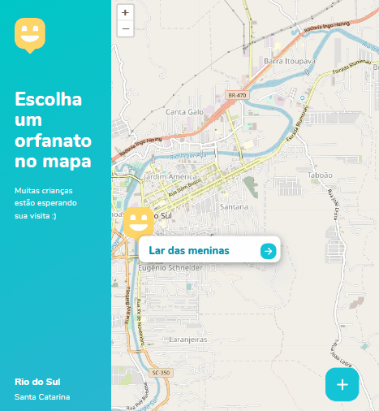

<p align="center">
  </a>
</p>


<h1 align="center">

## Preview
### Home
  

<h1 align="center">
  
</h1>


### Mapa de orfanatos
   
</h1>

## Sobre o projeto

Uma aplicação em vários ambientes, tanto mobile quanto front-end e back-end, com o objetivo de facilitar o encontro entre pessoas e orfanatos.

O projeto está sendo desenvolvido pelo conteúdo passsado na [Next Level Week](https://nextlevelweek.com/episodios/omnistack/1/edicao/3)

### 🛠 Tecnologias
As seguintes ferramentas foram usadas na construção do projeto:

[HTML5](https://developer.mozilla.org/en-US/docs/Web/Guide/HTML/HTML5)<br>
[CSS3](https://developer.mozilla.org/pt-BR/docs/Learn/CSS/First_steps/O_que_e_CSS) <br>
[JavaScript](https://exercism.io/my/tracks/javascript)
[Node.js](https://nodejs.org/en/) <br>
[Express](https://expressjs.com/pt-br/) <br>
[SQLite](https://www.sqlite.org/index.html) <br>

### Pré-requisitos

Antes de começar, você vai precisar ter instalado em sua máquina as seguintes ferramentas:
[Git-Bash](https://git-scm.com), [Node.js](https://nodejs.org/en/).
Além disto é bom ter um editor para trabalhar com o código como [VSCode](https://code.visualstudio.com/download)

###  Rodando a aplicação web (Front End)

```bash
# Clone este repositório
$ git clone https://github.com/paulofreitas-py/NLW-3-Discovery
Site is ready to be published at https://paulofreitas-py.github.io/NLW-3-Discovery/. 

```

##  Licenças

Esse projeto está sob a licença MIT. Veja o arquivo [LICENSE](LICENSE.md) para mais detalhes.

##  Creditos

- [RocketSeat](https://rocketseat.com.br/)
- [Mayk Brito](https://github.com/maykbrito)
- [Diego Fernandes](https://github.com/diego3g)


<h1 align="center">

[](https://www.linkedin.com/in/paulo-freitas-3a3995178/) [](https://www.instagram.com/paulofreitas.py/) 
</h1>


